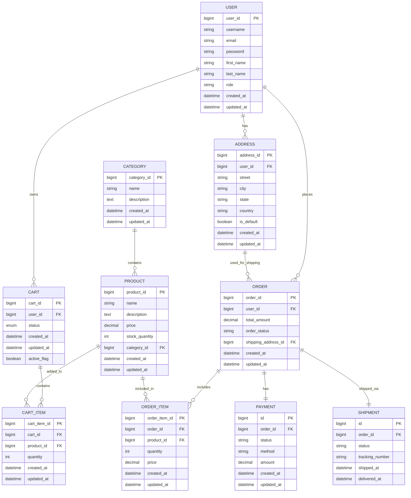

# 🛒 ShopSphere E-commerce API

A modern RESTful E-commerce API built with Spring Boot, smart shopping cart management, and complete order processing. Built with clean architecture and modern development practices for scalable e-commerce applications.

## ✨ Key Features

- **JWT Authentication & Authorization** with role-based access control
- **Advanced Shopping Cart System** with smart cart management
- **Complete Order Management** from cart to order tracking
- **Product Catalog Management** with categories and inventory tracking
- **Shipping & Tracking System** with real-time status updates
- **User Management** with multiple role profiles and multiple addresses (with default address selection)
- **Payment Processing** with multiple payment methods
- **Search and pagination** for improved user experience
- **Global exception handling** with custom error responses
- **Clean architecture** with layered design

## 🛠️ Tech Stack

- **Backend**: Spring Boot, Spring Security, Spring Data JPA
- **Database**: MySQL with JPA/Hibernate
- **Security**: JWT tokens, BCrypt password hashing
- **Build Tool**: Maven
- **Tools**: MapStruct, Lombok, Bean Validation
- **Java Version**: 21
- **Additional**: Spring Boot DevTools

## 📊 Database Schema



## 🚀 Getting Started

### Setup

```bash
git clone https://github.com/hagagg/ShopSphere-Ecommerce.git
cd ShopSphere-Ecommerce
```

### Configuration

Update `application.properties` with your database connection properties:

```properties
# Database Configuration
spring.datasource.url=jdbc:mysql://localhost:3306/shopsphere
spring.datasource.username=your_username
spring.datasource.password=your_password
spring.datasource.driver-class-name=com.mysql.cj.jdbc.Driver

# JPA Configuration
spring.jpa.hibernate.ddl-auto=none
spring.jpa.show-sql=false
```

### Run

```bash
mvn spring-boot:run
```


## 🔐 Security Features

- **JWT Authentication**: Secure token-based authentication
- **Role-based Access Control**: Different permissions for users and admins
- **Password Encryption**: BCrypt hashing for secure password storage
- **Input Validation**: Comprehensive request validation

## 🚧 Advanced Features

### Smart Cart System
- **One Active Cart Per User**: Ensures data consistency with generated columns
- **Cart Status Management**: `ACTIVE`, `ORDERED`, `CANCELLED`, `PENDING`
- **Persistent Cart Items**: Cart survives user sessions and device switches

### Complete Order Lifecycle Management
- **Order Status Tracking**: `PENDING`, `PAID`, `PROCESSING`, `SHIPPED`, `CANCELLED`
- **Order Creation**: From cart to confirmed order
- **Automated Workflow**: Complete order management pipeline

### Advanced Payment System
- **Multiple Payment Methods**: `CREDIT_CARD`, `PAYPAL`, `FAWRY`
- **Payment Status Tracking**: `PENDING`, `SUCCESS`, `FAILED`, `CANCELLED`

### Comprehensive Shipping Management
- **Real-time Shipment Tracking**: `PENDING`, `IN_TRANSIT`, `DELIVERED`, `RETURNED`, `CANCELLED`
- **Automated Status Updates**: Integration-ready for shipping providers
- **Delivery Confirmation**: Timestamp tracking for all status changes

## 🤝 Contributing

1. Fork the repository
2. Create a feature branch (`git checkout -b feature/new-feature`)
3. Commit your changes (`git commit -m 'Add new feature'`)
4. Push to the branch (`git push origin feature/new-feature`)
5. Open a Pull Request

## 👨‍💻 Author

**Ahmed Hagag** - [@hagagg](https://github.com/hagagg)
